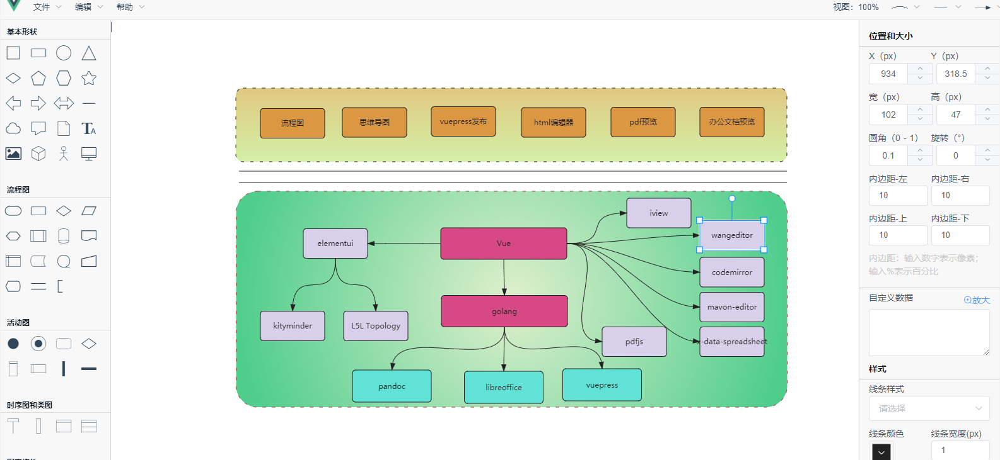
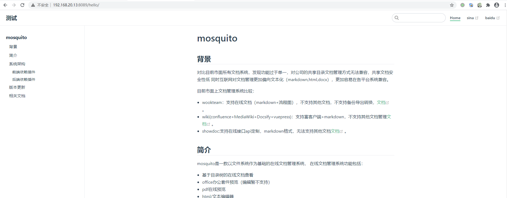
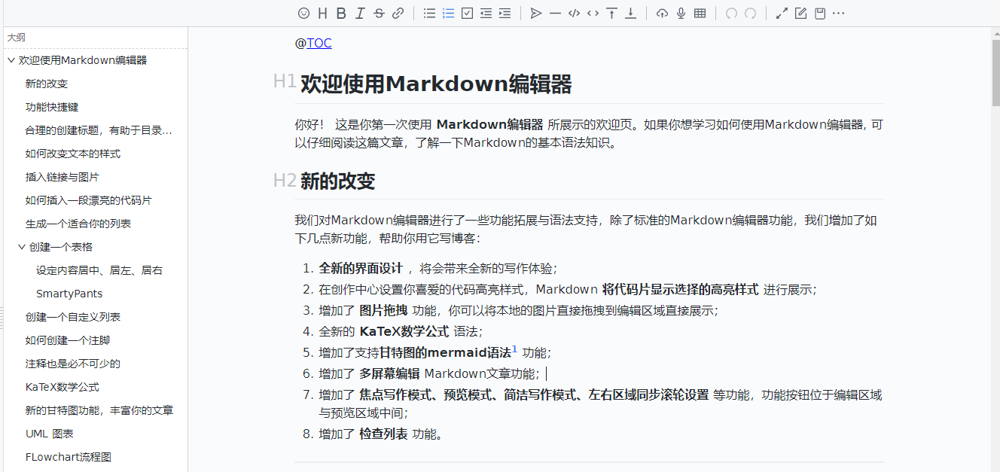
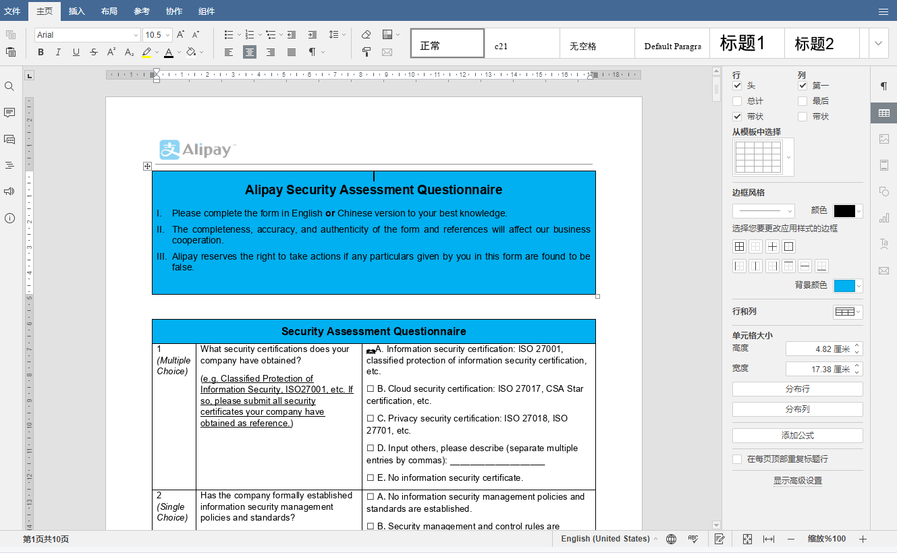
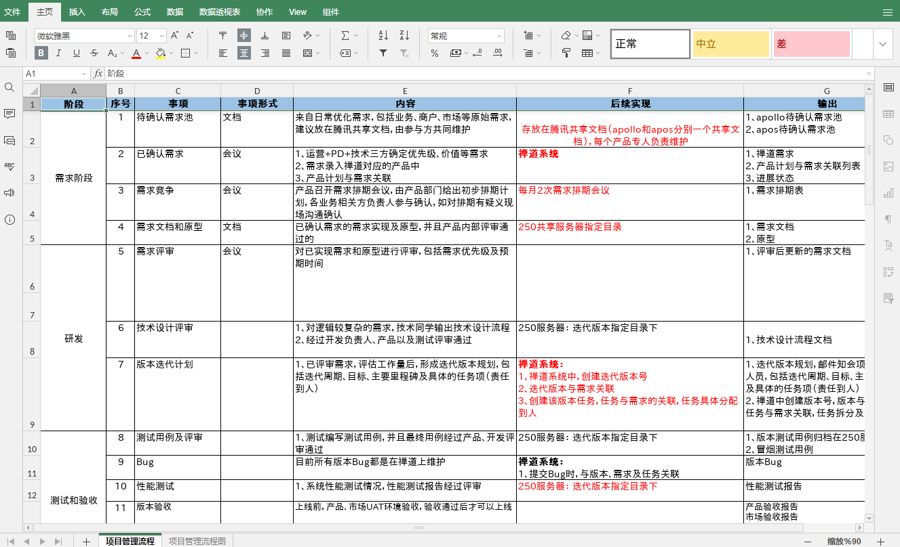
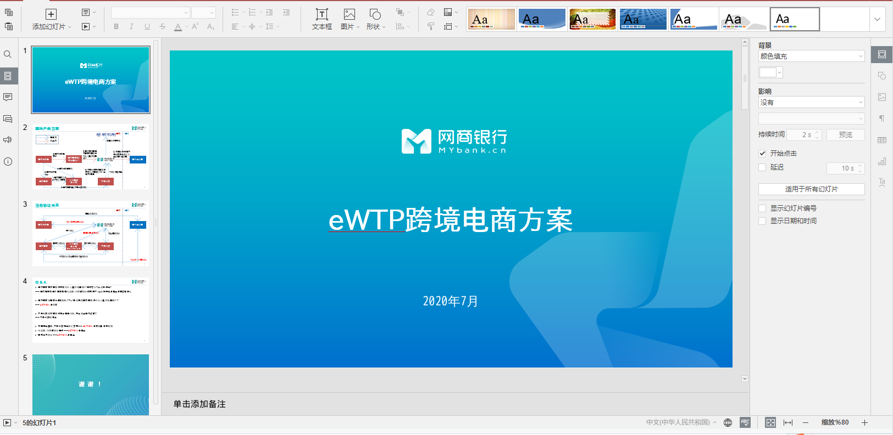
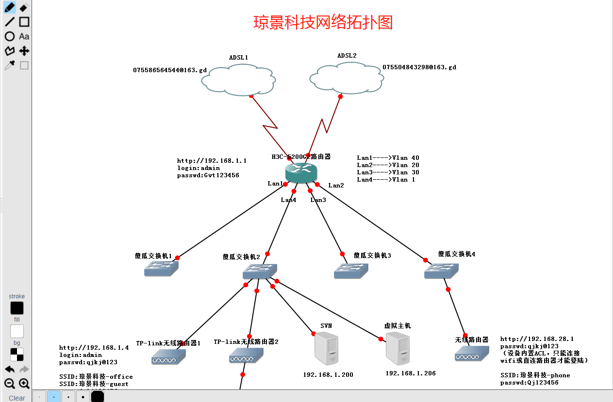
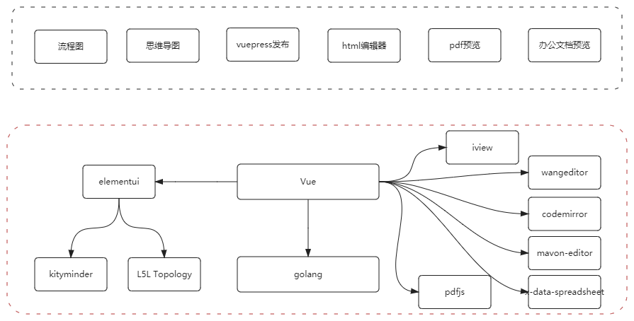

# mosquito
## 背景
 对比目前市面所有文档系统，发现功能过于单一，对公司的共享目录文档管理方式无法兼容，共享文档安全性低
 同时互联网对文档管理更加偏向文本化（markdown,html,docx），平台间更易兼容。
 
目前市面上文档管理系统比较：
 - wookteam：支持在线文档（markdown+流程图），不支持其他文档，不支持备份导出转换，[文档](https://gitee.com/aipaw/wookteam)。
 - wiki(confluence+MediaWiki+Docsify+vuepress)：支持富客户端+markdown，不支持其他文档管理[文档](https://www.jianshu.com/p/f79236289793)。
 - showdoc:支持在线接口api定制，markdown格式，无法支持其他文档[文档](https://www.showdoc.com.cn/demo?page_id=7)。
 - vuepress: 支持markdown写作，需要安装辅助和熟悉前端语言，必须线下操作，部署麻烦[文档](https://www.vuepress.cn/guide/getting-started.html)。
## 简介
mosquito是一款以文件系统作为基础的在线文档管理系统，
在线文档管理系统功能包括：
- 基于目录树的在线文档查看
- office办公套件预览和编辑
- pdf在线预览
- html/文本编辑器
- 在线代码编辑器
- 图片预览功能（后续支持在线绘图）
- markdown编辑器
- 思维导图编辑器
- 在线作图编辑器（流程图 ，活动图，类图，时序图等）

效果图：

<b>1.流程图：</b>

<b>2.思维导图：</b>

<b>3.vuepress</b>

<b>4.markdown(所见即所得类typora)</b>

<b>5.word在线编辑</b>

<b>6.excel在线编辑</b>

<b>7.ppt在线编辑</b>

<b>8.图片在线编辑</b>

<b>9.其他文档功能包括：</b>
- 在线代码编辑
- 在线txt和html编辑
- 在线pdf预览
- 文档发送email
- 通过模板生成文件

 ## 系统架构
 
 ### 前端依赖插件
 - pdfjs（pdf预览器）[教程](http://mozilla.github.io/pdf.js/)
 - mavon-editor（markdown编辑器）[教程](https://github.com/hinesboy/mavonEditor)
 - codemirror（代码编辑工具）[教程](https://github.com/surmon-china/vue-codemirror)
 - wangeditor（html文本编辑器）[教程](http://www.wangeditor.com/)
 - x-data-spreadsheet（废弃，excel预览工具）[教程](https://github.com/myliang/x-spreadsheet)
 - onlyoffice(office协作)[教程](https://api.onlyoffice.com/)
 - mxgraph(废弃，流程图，无导出功能) [教程](https://jgraph.github.io/mxgraph/javascript/examples/grapheditor/www/index.html)
 - 乐吾乐 Topology（正方形错误，其他图形待绘制）[教程](https://www.yuque.com/alsmile/topology/make-shape)
 - kityminder-core（思维导图）[教程](https://github.com/fex-team/kityminder-core/wiki/command)
### 后端依赖插件
 - beego [教程](https://beego.me/docs/intro/)
 - go-smb2 [教程](https://github.com/hirochachacha/go-smb2)
 - goftp [教程](https://github.com/dutchcoders/goftp)
 ## 版本更新
# 1.0.2[2021-03-23]
- change：支持图片在线预览,在线涂鸦，保存功能暂时关闭[jiaozi]
- change：支持所见即所得markdown [jiaozi]
- change：拖拽上传文件功能增强（上传进度条） [jiaozi]
- change： vuepress支持个人和公共编译 [jiaozi]
- Feature：支持模板创建文件 [jiaozi]
- Feature：支持跨空间拷贝 [jiaozi]
- Feature：支持流程图和思维导图生成图片 [jiaozi]
- Feature：支持文档发送邮件 [jiaozi]
- Feature：支持文件拖拽功能 [jiaozi]
- Feature：支持权限控制 [jiaozi]
- Feature：支持内外网共享功能 [jiaozi]
- Feature：支持office在线编辑 [jiaozi]
# 1.0.1 [2020-12-7]
- Feature： 支持文档系统基本功能[jiaozi]
 ## 相关文档
 1. [用户操作手册](doc/user.md)
 2. [运维手册](doc/oper.md)
 3. [二次开发引导手册](doc/dev.md)  
 3.1. [前端关联编辑器](doc/devf.md) 
 3.2. [后端文件系统开发](doc/devb.md)
 4. [参数配置手册](doc/conf.md)
