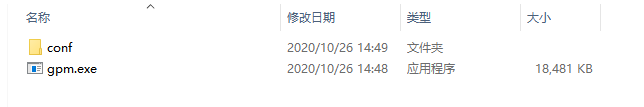

# mosquito

## 系统依赖项目
### vuepress
项目依赖vuepress构建markdown项目。

安装:
```
npm install -g vuepress
```
安装完成后确认是否可直接使用命令(环境变量PATH中配置)。
详细vuepress教程参考[官网](https://www.vuepress.cn/guide/getting-started.html)
### pandoc
项目依赖pandoc将markdown转换为doc文件。

安装（直接下载到指定目录）:
```
https://github.com/jgm/pandoc/releases/tag/2.11 找到对应系统版本
```
解压后修改conf/app.conf
```
pandocpath=你解压的pandoc目录/pandoc
```
### libreoffice
项目依赖libreoffice实现doc|xls|ppt转换为pdf。
#### window安装
https://zh-cn.libreoffice.org/download/libreoffice/ 找到对应版本的下载安装
桌面生成的快捷方式右键找到对应目标：
```
"C:\Program Files\LibreOffice\program\soffice.exe"
```
#### linux安装
```$xslt
 yum -y install libreoffice
```

解压完成修改conf/app.conf
```
libreofficepath=C:/Program Files/LibreOffice/program/soffice.exe
```
## 系统部署
### 后台部署
#### 编译打包
克隆源代码
```$xslt
  git clone https://github.com/lzeqian/gpm.git
```
在部署系统(window|linux)中golang语言环境，[详情参考](https://blog.csdn.net/liaomin416100569/article/details/106082235)

执行命令编译:
 ```$xslt
   go build
 ```
window根目录下shengcheng gpm.exe，linux下生成gpm。
> 注意生成可执行文件和conf目录是必须同时存在的，否则配置无法生效
> 具体配置请参考conf/app.conf,端口配置：httpport = 8080


#### 运行测试
执行gpm运行
```$xslt
$ ./gpm
2020/10/26 14:53:59.981 [I] [asm_amd64.s:1373]  http server Running on http://:8080
```
浏览器测试接口
```$xslt
http://localhost:8080/home/tree
```
### 前端部署
#### 编译打包
安装nodejs环境，[参考](https://blog.csdn.net/liaomin416100569/article/details/81746168)

进入front/gpm-frontend目录下
```$xslt
 npm i && npm run serve
```
>上述用于测试，实际生产可以使用 npm run build 将生成dist目录内容部署在nginx中。
>
#### 配置
- 开发运行端口位于： vue.config.js，port: 8085 部分。
- 前端调用后端服务器地址：src/utils/env.js中。

